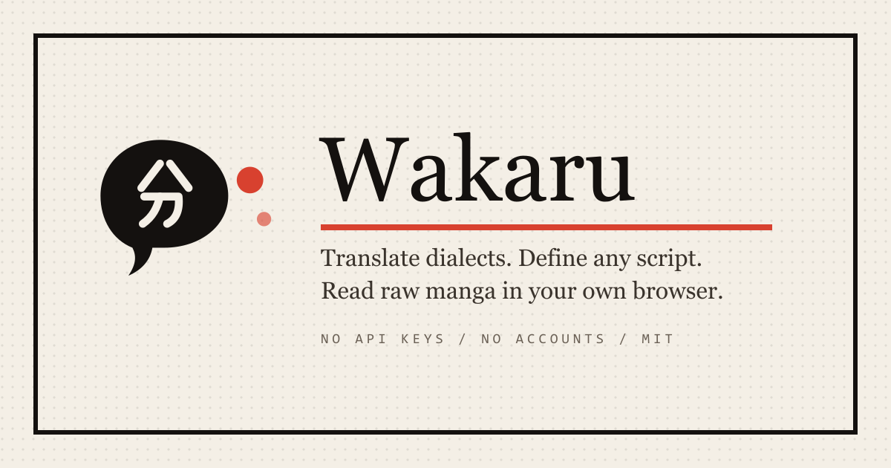
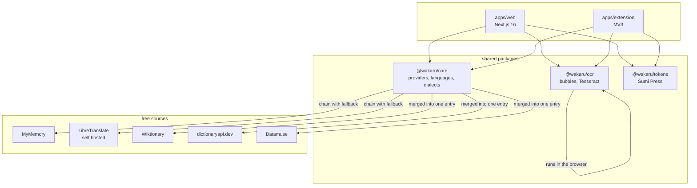

<div align="center">


# Wakaru

**Translate dialects. Define any script. Read raw manga.**

A translator, a multilingual dictionary and a manga reader, built entirely on
free sources. No API keys, no accounts, no paid tier, no trial.

[](LICENSE)
[](#the-free-provider-stack)
[](https://nextjs.org)
[](https://www.typescriptlang.org)
[](https://tesseract.projectnaptha.com)
[](#languages-and-dialects)
[](#languages-and-dialects)
[](CONTRIBUTING.md)
[](https://github.com/Abudora-0/Wakaru/actions/workflows/ci.yml)

</div>

<div align="center">
  
</div>

---

## What it does

**Translate** between roughly a hundred languages, then refine the result for a
specific region. Ask for Mexican Spanish and `ordenador` becomes `computadora`.
Ask for Punjabi in Shahmukhi and the Gurmukhi is transliterated into the
Perso-Arabic script. Every substitution is listed underneath the translation
with a confidence level and a reason, so nothing is changed invisibly.

**Define** a word in any of 107 languages. Definitions, IPA, recordings by real
human speakers, synonyms, antonyms and example sentences, merged from several
sources into one entry with the licences attributed in the margin.

**Read** a raw Japanese, Korean or Chinese page. Speech bubbles are detected,
the text is recognised and translated, and the result is drawn back into the
bubbles it came from. Recognition runs in your browser, so the page is never
uploaded anywhere. A browser extension does the same thing in place on any raw
site you are already reading.

## Quick start

```bash
git clone https://github.com/Abudora-0/Wakaru.git
cd Wakaru
npm install
npm run dev
```

That is the whole setup. There is nothing to configure and no key to obtain,
because every provider works anonymously. Open http://localhost:3000.

```bash
npm run dev          # the web app on port 3000
npm test             # unit tests, no network, no quota spent
npm run test:live    # hits the real providers, run this deliberately
npm run e2e          # end to end, against a production build
npm run check        # house style, types and tests
npm run ext:build    # build the browser extension
npm run brand:build  # regenerate every icon from brand/*.svg
```

## The free provider stack

Every source below was probed live before it was wired in. This table records
what was actually true, including the parts that are inconvenient.

| Source | Status | Provides | Limit |
|---|---|---|---|
| [MyMemory](https://mymemory.translated.net) | live, keyless | translation, about 100 pairs | 5,000 chars a day, 50,000 with an email |
| [LibreTranslate](https://github.com/LibreTranslate/LibreTranslate) | self hosted | translation | none, it is your machine |
| [dictionaryapi.dev](https://dictionaryapi.dev) | live, keyless | English definitions, IPA, audio | fair use |
| [Wiktionary REST](https://en.wiktionary.org/api/rest_v1/) | live, keyless | definitions in ~180 languages | fair use |
| [Lingua Libre](https://lingualibre.org) via Wiktionary | live, keyless | human pronunciation recordings | fair use |
| [Datamuse](https://www.datamuse.com/api/) | live, keyless | English synonyms and antonyms | 100k a day |
| [Tesseract.js](https://tesseract.projectnaptha.com) | in your browser | OCR for jpn, jpn_vert, kor, chi, eng | none, it is local |

Two of these deserve a note rather than a footnote:

**The public LibreTranslate instance now requires an API key.** It is only free
if you run it yourself, which is one command and is genuinely worth doing:

```bash
docker compose -f docker/libretranslate.yml up -d
echo "LIBRETRANSLATE_URL=http://localhost:5000" >> .env.local
```

Once that is set the provider chain puts it first automatically. No quota, no
third party, nothing leaving your network.

**The undocumented Google endpoint is included but disabled.** It is keyless
and by far the highest quality option, and it is also undocumented, rate
limited by IP address and not covered by any published terms for this use.
Turning it on is a deliberate decision for whoever runs the deployment, not a
default, so it sits behind `WAKARU_ENABLE_GTX`.

### Why a chain rather than an API

No free provider is reliable on its own. Providers are tried in priority order
behind a circuit breaker: three consecutive failures bench a provider for a
minute, and a quota refusal benches it for fifteen. Results are cached in an
LRU in front of CDN cache headers, which is what makes a 5,000 character daily
budget survive contact with more than one visitor. Every response says which
provider served it and what it fell back from, and the interface shows that
rather than hiding it.

## Languages and dialects

107 languages, 31 curated dialects.

**No free API exposes dialects.** Not one. So the dialect layer is not an API
call, it is a hand written, reviewable dataset in this repository, applied in
three passes after translation:

1. **Locale routing.** Pass `pt-BR` upstream where a provider understands it,
   and fall back to `pt` where it does not.
2. **Lexicon overlay.** Substitution maps with a confidence level and a note.
   `coger` becomes `tomar` for Mexico, flagged high confidence, because `coger`
   is vulgar there. `rapariga` becomes `garota` for Brazil for the same reason.
3. **Script transliteration.** Serbian Cyrillic and Latin map one to one and
   are marked lossless. Gurmukhi to Shahmukhi and Devanagari to Latin are
   approximations and are marked lossy, with the reason shown to the reader.

Devanagari romanisation is done with syllabic rules rather than a lookup table,
because Indic consonants carry an inherent vowel that is never written. A
character map turns नमस्ते into `nmste`. Wakaru returns `namaste`, and returns
`kamal` rather than `kamala` for कमल because Hindi drops the final inherent
vowel.

Adding a dialect means appending one object to
[`packages/core/src/dialects/data.ts`](packages/core/src/dialects/data.ts).
No code changes. See [CONTRIBUTING.md](CONTRIBUTING.md).

## Reading raw manga

A website cannot read another website's page, so the in place reader is a
browser extension. The site itself takes a page you give it.

```bash
npm run ext:build
```

Then load `apps/extension/.output/chrome-mv3` at `chrome://extensions` with
developer mode on. A seal appears on every large image; press it to read that
page.

Three details in there are worth knowing about, because they are the parts that
usually break:

- **Cross origin images taint a canvas**, and a tainted canvas cannot be read
  back, which would defeat OCR on essentially every real site. The extension
  fetches the image bytes in the background service worker instead and hands
  them on as a data URL.
- **A service worker has no DOM**, so Tesseract cannot run in it. Recognition
  happens in an MV3 offscreen document, which is kept alive between pages so
  the language model downloads once rather than on every page turn.
- **Site access is requested per site**, on first use, rather than at install.
  An extension like this asking for every URL up front is normal and is the
  wrong default.

Bubble detection is plain canvas work rather than OpenCV, which would add about
eight megabytes to a page that already downloads a language model. A bubble is
an enclosed light region that does not touch the page border, is roughly convex
inside its own bounding box, and contains ink at a density that reads as text
rather than as artwork. Tall narrow regions are read with the vertical Japanese
model. Pages with no bubbles at all, which is most webtoons, fall back to whole
page recognition.

Wakaru is source agnostic and works on local files. Respecting the copyright on
whatever you point it at is your responsibility.

## Design

The interface is called **Sumi Press**. It is built on ink, paper and print
rather than on gradients and rounded cards, and every control is drawn from
scratch:

- **Scrollbars** are square, with a screentone track and a vermilion thumb.
- **Buttons** carry a solid offset shadow with zero blur and travel into it
  when pressed, so a button stamps rather than lifts.
- **The translate control is a seal**, and pressing it rotates as it stamps.
- **The source field is genkō yōshi**, Japanese manuscript paper, one square
  per character.
- **The language picker is a real ARIA combobox**, never a native select, with
  a sample of each language's own script instead of a flag. A flag names a
  country, not a language, and choosing one for Arabic or Spanish would be a
  political statement.
- **Loading is a screentone shimmer**, never a spinner.
- **Ctrl and K opens a command palette** that jumps to any page, finds any of
  the 107 languages, or defines whatever you type. It is a real modal dialog:
  it takes focus, traps it, and hands it back to whatever opened it.
- Radius never exceeds 4px. The seal is the only round object in the system.

Two themes: Paper and Night Ink. Both are explicit, so a chosen theme beats the
operating system in either direction.

Accessibility is treated as functional, not decorative: every foreign string
carries its own `lang` and `dir`, right to left renders correctly in Arabic,
Urdu and Hebrew, the combobox is fully keyboard operable, focus rings are loud,
and `prefers-reduced-motion` disables the stamps and speed lines.

There is no CSS framework. The design system is hand written, so a utility
framework on top of it would have contributed nothing but a dependency.

## Architecture



`packages/core` imports no framework, so the web app and the extension run the
same provider logic, the same language registry and the same dialect rules
rather than two copies that drift apart.

```
wakaru/
  apps/
    web/          Next.js 16, route handlers, pages
    extension/    MV3, content script, offscreen OCR, popup
  packages/
    core/         providers, language registry, dialect engine
    ocr/          bubble detection, preprocessing, Tesseract
    tokens/       design tokens and control primitives
  brand/          the four logo sources, everything else is generated
  docker/         self hosted LibreTranslate
  scripts/        house style guard, brand build
```

## Deploying

Wakaru needs no environment variables to run, so a deploy is genuinely just an
import. The only thing to get right is the root directory, because this is an
npm workspace monorepo and the site lives in `apps/web`.

[](https://vercel.com/new/clone?repository-url=https%3A%2F%2Fgithub.com%2FAbudora-0%2FWakaru&project-name=wakaru&repository-name=wakaru&root-directory=apps%2Fweb)

Importing by hand instead:

1. **vercel.com/new**, then import `Abudora-0/Wakaru`.
2. Set **Root Directory** to `apps/web`. Vercel still installs from the
   workspace root, so the shared packages resolve.
3. Framework preset should read **Next.js**. Leave the build and output
   settings alone.
4. Deploy. Nothing else is required: every provider works anonymously.

### Optional environment variables

None of these are needed. See [.env.example](.env.example).

| Variable | Effect |
|---|---|
| `MYMEMORY_EMAIL` | Lifts the MyMemory daily budget from 5,000 to 50,000 characters |
| `LIBRETRANSLATE_URL` | Points at your own LibreTranslate, which removes the quota entirely and takes priority over everything else |
| `LIBRETRANSLATE_API_KEY` | Only for a hosted LibreTranslate instance |
| `WAKARU_ENABLE_GTX` | Turns on the undocumented Google endpoint. Read the note above before you do |

### After the first deploy

The extension needs to know where your deployment lives. Either set it in the
extension popup under **Translator endpoint**, or change the default in
[`apps/extension/lib/messages.ts`](apps/extension/lib/messages.ts) and rebuild.

## House rules

**No em dashes.** Not in code, not in UI copy, not in documentation. This is
enforced mechanically rather than by review:

```bash
npm run check:emdash
```

It runs in the pre-commit hook and in CI and fails the build, because a style
rule nobody can enforce is not a rule.

**Commits use Conventional Commits** and carry no AI or assistant attribution:
no `Co-Authored-By` trailer, no generated-with footer.

**Tests never touch the network.** `npm test` runs against recorded fixtures so
it cannot fail because a free provider is down and cannot spend a daily quota.
The end to end suite stubs the provider routes for the same reason. Anything
that genuinely needs a live endpoint is quarantined: `*.live.test.ts` behind
`npm run test:live`, and specs tagged `@live` behind `npm run e2e:live`.

## Roadmap

- [ ] Firefox build of the extension, which needs a background page path since
      Firefox MV3 has no offscreen API
- [ ] More dialects, particularly South Asian and African varieties
- [ ] Furigana readings on Japanese dictionary entries
- [ ] Saved word lists and export
- [ ] Whole volume reading in the extension rather than page by page

## Contributing

See [CONTRIBUTING.md](CONTRIBUTING.md). Adding a dialect is a one file change
and is the most useful thing anyone can contribute.

## Acknowledgements and licences

Wakaru is MIT licensed. The data it displays is not, and the interface carries
the attribution the licences require rather than burying it:

- **[Wiktionary](https://en.wiktionary.org)** definitions and examples, CC BY-SA 4.0
- **[dictionaryapi.dev](https://dictionaryapi.dev)**, sourced from Wiktionary, CC BY-SA 3.0
- **[Lingua Libre](https://lingualibre.org)** and Wikimedia Commons recordings, CC BY-SA 4.0
- **[MyMemory](https://mymemory.translated.net)**, free tier, attribution requested
- **[Datamuse](https://www.datamuse.com/api/)**, free for public use
- **[LibreTranslate](https://github.com/LibreTranslate/LibreTranslate)**, AGPL-3.0, run separately
- **[Tesseract.js](https://tesseract.projectnaptha.com)**, Apache-2.0

Every dictionary entry stamps its sources in the margin. That is a licence
obligation, and it was designed to look deliberate rather than apologetic.

---

<div align="center">
<sub>

`translator` `dictionary` `dialects` `manga` `manhwa` `ocr` `tesseract`
`wiktionary` `pronunciation` `ipa` `text-to-speech` `nextjs` `typescript`
`browser-extension` `chrome-extension` `manifest-v3` `i18n` `transliteration`
`no-api-key` `self-hosted`

</sub>
</div>
